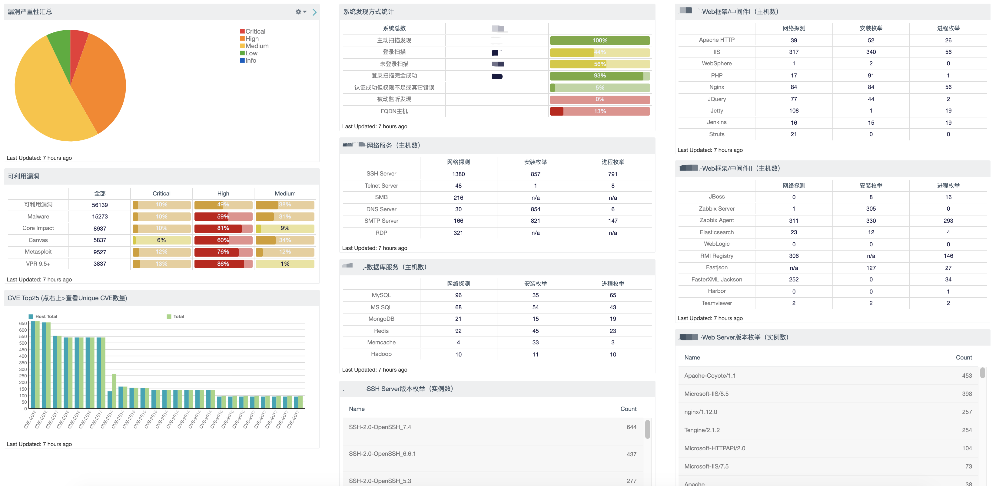

# 资产查询规则库 for tenable.sc

## 名词定义

1. *标准探测*:通过nessus标准资产plugin，不限于remote、local或combine
2. *安装枚举*：通过nessus标准安装枚举plugin
3. *进程枚举*：通过Nessus标准进程枚举plugin
4. *自定义探测*: 通过基于Custom Audit(aka. 自定义基线脚本)的自定义探测

### 自定义探测脚本

* 自定义探测基线脚本（Custom Audit File）[点击下载]
* Nessus Custom Audit [项目传送门]

## 规则文件
* [tenablesc_asset.yml](tenablesc_asset.yml)

## 解析器
将规则文件自动解析成 SC API query。
- [todo]

## 可视化示例

## Credits

- HTSC Sec team
- Yoyo

[点击下载]:https://github.com/shawntns/ns_custom_audit/blob/master/asset_discovery.audit
[项目传送门]:https://github.com/shawntns/ns_custom_audit